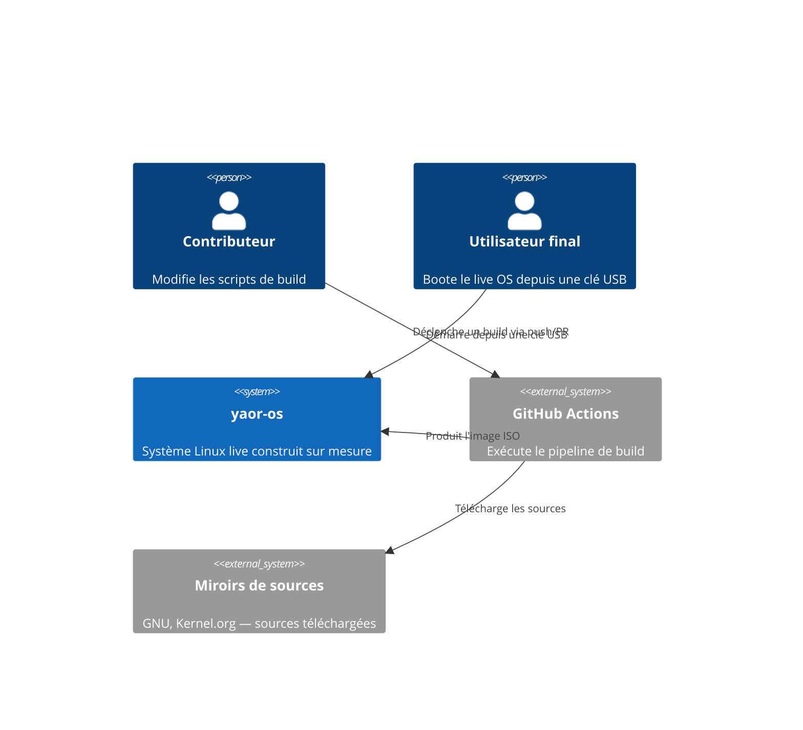
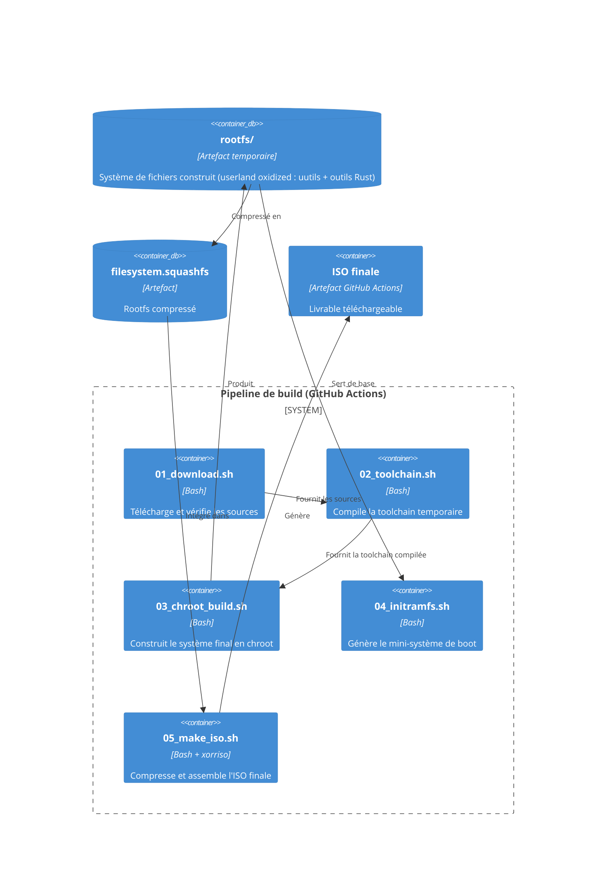

# Vue d'ensemble système (C4 — Niveaux 1 et 2) — yaor-os

**Statut :** Brouillon
**Version :** 0.2

## Niveau 1 — Contexte

```mermaid
C4Context
    Person(contributeur, "Contributeur", "Modifie les scripts de build")
    Person(utilisateur, "Utilisateur final", "Boote le live OS depuis une clé USB")
    System(yaor_os, "yaor-os", "Système Linux live construit sur mesure")
    System_Ext(github, "GitHub Actions", "Exécute le pipeline de build")
    System_Ext(mirrors, "Miroirs de sources", "GNU, Kernel.org — sources téléchargées")

    Rel(contributeur, github, "Déclenche un build via push/PR")
    Rel(github, mirrors, "Télécharge les sources")
    Rel(github, yaor_os, "Produit l'image ISO")
    Rel(utilisateur, yaor_os, "Démarre depuis une clé USB")
```

## Niveau 2 — Conteneurs

```mermaid
C4Container
    System_Boundary(pipeline, "Pipeline de build (GitHub Actions)") {
        Container(download, "01_download.sh", "Bash", "Télécharge et vérifie les sources")
        Container(toolchain, "02_toolchain.sh", "Bash", "Compile la toolchain temporaire")
        Container(chroot, "03_chroot_build.sh", "Bash", "Construit le système final en chroot")
        Container(initramfs, "04_initramfs.sh", "Bash", "Génère le mini-système de boot")
        Container(iso, "05_make_iso.sh", "Bash + xorriso", "Compresse et assemble l'ISO finale")
    }
    ContainerDb(rootfs, "rootfs/", "Artefact temporaire", "Système de fichiers construit (userland oxidized : uutils + outils Rust)")
    ContainerDb(squashfs, "filesystem.squashfs", "Artefact", "Rootfs compressé")
    Container(livrable, "ISO finale", "Artefact GitHub Actions", "Livrable téléchargeable")

    Rel(download, toolchain, "Fournit les sources")
    Rel(toolchain, chroot, "Fournit la toolchain compilée")
    Rel(chroot, rootfs, "Produit")
    Rel(rootfs, initramfs, "Sert de base")
    Rel(rootfs, squashfs, "Compressé en")
    Rel(squashfs, iso, "Intégré dans")
    Rel(iso, livrable, "Génère")
```
